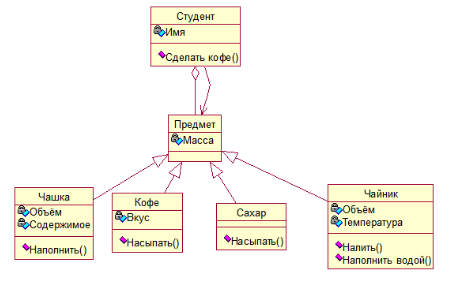
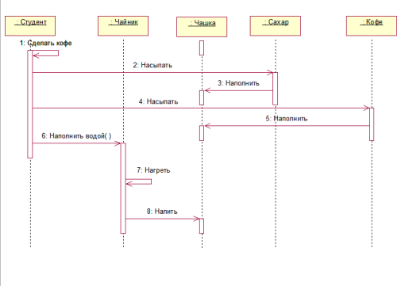

SecondLab
Вариант 12
Реализовать классы Студент, Чашка, Кофе, Сахар, Чайник.
Которые реализуют процесс приготовления кофе. 
Метод сделать кофе() класса Студент Насыпать() класса Сахар, который вызывает Наполнить() класса Чашка. 
После этого вызывается метод Насыпать() класса Кофе, вызывающий такой же метод класса Чашка. 
После этого Вызывается метод Наполнить водой() класса Чайник, который в свою очередь вызывает метод Налить(), 
а он в свою очередь вызывает метод наполнить() класса Чашка.

